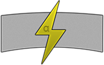

## hydroelectric
a simple way to revise notes

## Description

Hydroelectric organises revision notes into topics and subjects and displays these notes.

Since revision notes need to be accessed wherever a user is, Hydroelectric uses a web interface to allow this.

Hydroelectric uses [Semantic Versioning](http://semver.org/) and [TomDoc](http://tomdoc.org/).

## Requirements

* Ruby 2.0.0
* Rails 3.2.13
